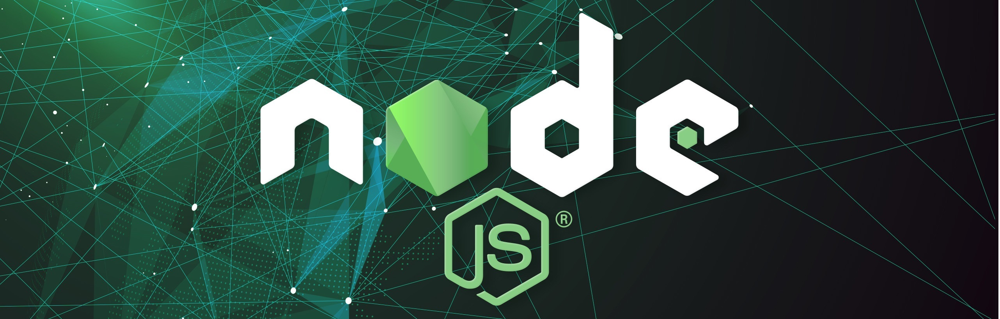

A new backend tool has just join the stack!

Most startups do face the decision which technology to use. As software development team we’re often asked to advise on this matter. And well, it always depends on the project. However, more often than not, we suggest Node JS as a good solution, and I’ll tell you why.
Why might Node.js be the right choice for your startup?
In my opinion, there are at least 3 reasons:

## Node.js provides faster delivery

We strongly believe in lean startup methodology, which fundamentally focuses on fast delivery of prototypes to test the concepts underlying a startup’s business. We believe Node.js helps to achieve this.
First, by sharing model code and tests between the client (say browser) and server, which constitutes a significant efficiency for a developer.
Second, Node.js excels as a “framework” for apps providing real-time experience or streaming. This relates to features like chats, transactions, reservations or some forms of advertising. Handling these in a JavaScript-based event-driven environment is easy. Sometimes even too easy.
What we also love when working with Node.js there is no mismatch between the backend and the frontend in terms of communication. That is, they work the same on both sides (JSON everywhere).
None of the above are game changers but they all save time, what is essential for a startup to stay lean. (I’m intentionally not mentioning ready components available via NPM, as other platforms also offer tools like Composer or Gem. Though, we do like NPM more)

## Node.js enables us to pivot faster

Startus do pivot
Startups do pivot, i.e. change fundamental parts of their business model as a process of measuring and learning.
Our experiences show that introduction of substantial changes to an application, as a result of business model change, happens smoother when the application model is based on Node.js’s event-driven model rather than a classic MVC (at least in most cases).
Faster startup pivoting is also partially related to Node’s partner in crime, MongoDB. As MongoDB is schema-less, we find the startup data storing significantly faster to alter when new business processes need to be handled by the application.

## Node.js scales easily

The goal is to build a killer startup that is scalable both in terms of business model and technology. Contrary to what some developers say, we do not find the Node.js/Javascript TECHNOLOGY to be more scalable than PHP, Ruby or Python. In fact, in some cases it might be even less scalable.
However, the benefit of Node.js is that is simply WAY easier to scale. Meaning that is close to scalable just out-of-the-box – you do not have to do the magic start handling the scale.

## Conclusion

Decision whether to do a project using a particular technology is hard. My advice is: keeping your startup lean (business-wise) is an important technical requirement. If so, Node.js might just be the right suit for your company.
